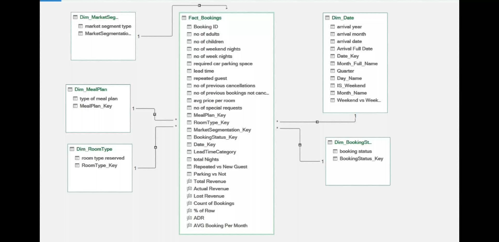
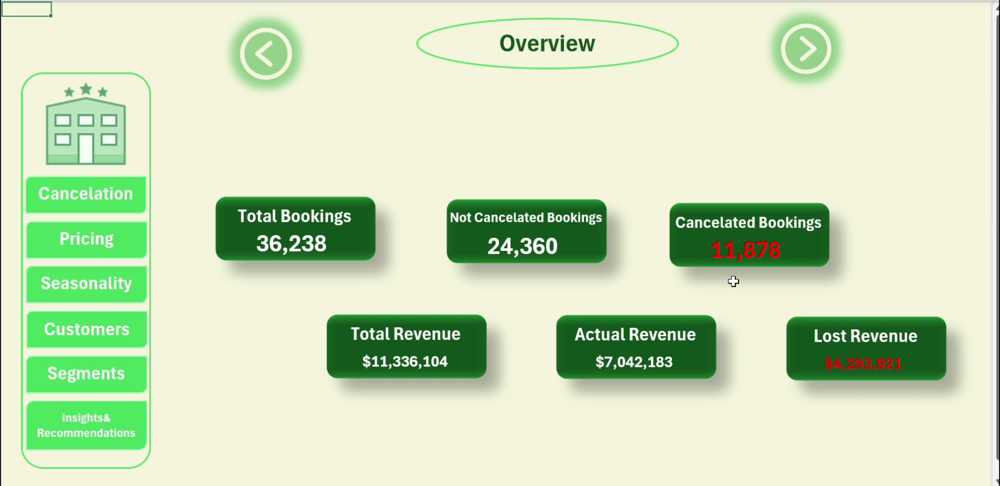
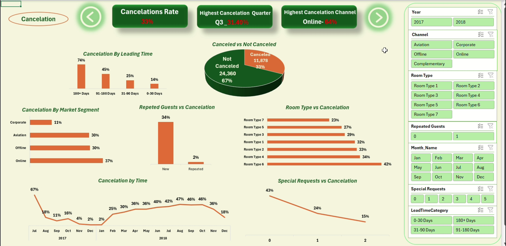
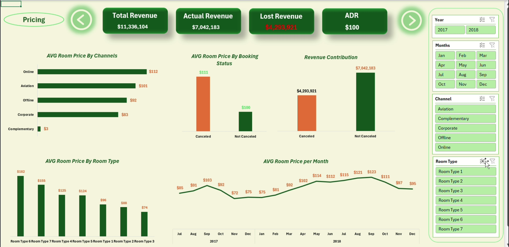
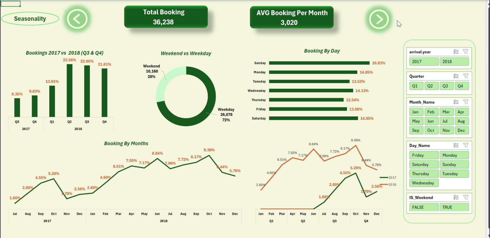
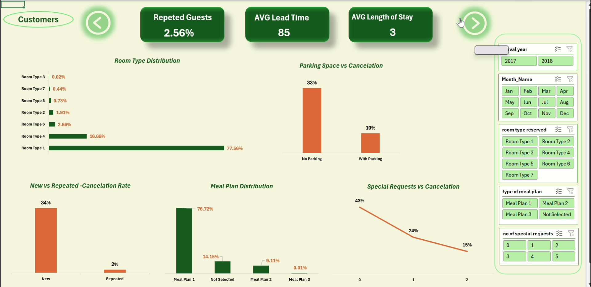
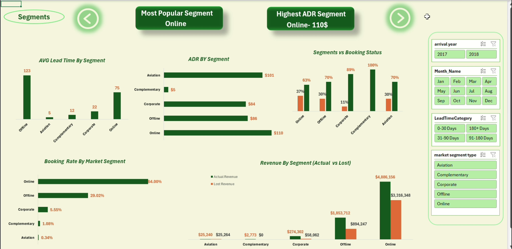
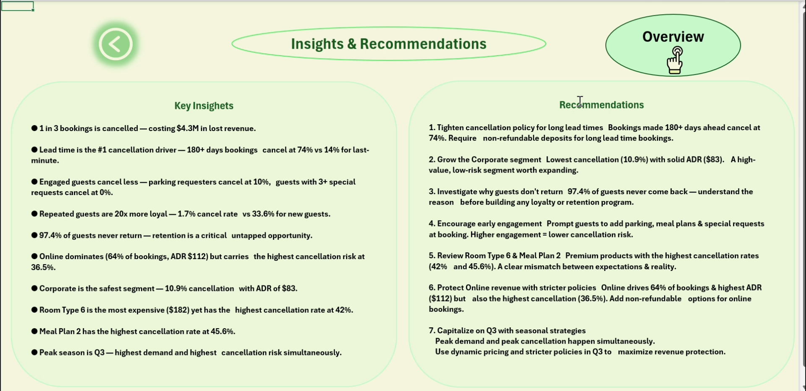

# 🏨 Hotel Reservations Dashboard

An end-to-end Excel data analysis project that uncovers what drives cancellations, how pricing varies across segments and room types, and who the hotel's customers really are.

The entire pipeline — from raw data to interactive dashboard — was built inside Microsoft Excel using:
- **Power Query** for data ingestion and transformation
- **Power Pivot** for building a relational Star Schema
- **DAX** for calculated KPIs and measures
- **PivotCharts + Slicers** for interactive visualization

**Key business outcomes:**
- Identified the primary drivers of the 32.8% cancellation rate
- Uncovered pricing inefficiencies across channels and room types
- Quantified the loyalty gap between new and returning guests
- Provided segment-level profitability signals


## 📋 Table of Contents
- [Dataset Description](#dataset-description)
- [Data Model — Star Schema](#data-model--star-schema)
- [ETL Process — Power Query](#etl-process--power-query)
- [DAX Measures](#dax-measures)
- [Dashboard Pages & Analysis](#dashboard-pages--analysis)
- [Key Insights](#key-insights)
- [Recommendations](#recommendations)
- [Tools & Technologies](#tools--technologies)
- [File Structure](#file-structure)


## 📦 Dataset Description

The raw data contains one record per hotel reservation and includes the following fields:

| Field | Description |
|---|---|
| Lead Time | Number of days between booking date and arrival date |
| AVG Price | Average price per room per night |
| Parking Space | Whether the guest requested a parking space (0/1) |
| Repeated Guest | Whether the guest has stayed before (0/1) |
| No. of Previous Cancellations | Count of past cancellations by this guest |
| No. of Previous Bookings | Count of prior bookings by this guest |
| No. of Special Requests | Number of special requests made |
| Room Type | Categorical room type (1–7) |
| Meal Type | Meal plan selected |
| Market Segment | Booking channel (Online, Offline, Corporate, Complementary, Aviation) |
| Booking Status | Whether the booking was canceled or not |
| Date | Arrival date (used to build the date dimension) |


## 🗂️ Data Model — Star Schema

The data is modeled as a classic Star Schema in Power Pivot, with one central fact table connected to five dimension tables via surrogate keys.





**Tables:**

**Fact_Bookings** (many side)
- Contains all transactional measures: lead time, price, parking, special requests, repeated guest flag, previous cancellations, previous bookings
- Foreign keys: Date_Key, Room_Type_SK, Meal_Type_SK, Market_Segment_SK, BookingStatus_SK

**Dim_Date** — Year, Quarter, Month, Day Name, Date_Key + calculated columns: Total Booking, Total Cancellation

**Dim_RoomType** — Room_Type_SK → Room Type

**Dim_MealPlan** — Meal_Type_SK → Meal Type

**Dim_MarketSegment** — Market_Segment_SK → Market Segment

**Dim_BookingStatus** — BookingStatus_SK → Booking Status

**Why Star Schema?**
- Enables fast aggregations via PivotTables
- Clean separation between descriptive attributes (dimensions) and numeric facts
- Makes DAX measures simpler and more readable
- Allows slicers on dimension tables to filter across all visuals simultaneously


## ⚙️ ETL Process — Power Query

Before loading data into the model, Power Query was used to clean and prepare each table:

1. **Remove duplicates** — ensured one record per reservation
2. **Handle nulls** — blank values in meal type and special requests filled or flagged
3. **Data type enforcement** — dates parsed correctly, numeric fields validated
4. **Surrogate key generation** — integer keys added to dimension tables for clean relationships
5. **Dimension table extraction** — unique values from segment, room type, meal type, and booking status extracted into separate dimension tables
6. **Calculated columns added:**
   - `total_nights` = weekday nights + weekend nights
   - `Guest_Type` — New vs Repeated
   - `Parking_Request` — With Parking vs No Parking
   - `Day_Type` — Weekday vs Weekend
   - `LeadTimeCategory` — 0-30, 31-90, 91-180, 180+ Days


## 📐 DAX Measures

Key calculated measures used across the dashboard:

```
-- Total Bookings
Total Bookings = COUNTROWS(Fact_Bookings)

-- Total Revenue
Total Revenue = SUMX(Fact_Bookings, Fact_Bookings[avg_price_per_room] * Fact_Bookings[total_nights])

-- Actual Revenue
Actual Revenue = SUMX(FILTER(Fact_Bookings, Fact_Bookings[booking_status] = "Not_Canceled"), Fact_Bookings[avg_price_per_room] * Fact_Bookings[total_nights])

-- Lost Revenue
Lost Revenue = SUMX(FILTER(Fact_Bookings, Fact_Bookings[booking_status] = "Canceled"), Fact_Bookings[avg_price_per_room] * Fact_Bookings[total_nights])

-- Cancellation Rate
Cancellation Rate = DIVIDE(CALCULATE(COUNTROWS(Fact_Bookings), Fact_Bookings[booking_status] = "Canceled"), COUNTROWS(Fact_Bookings))

-- ADR (Average Daily Rate)
ADR = DIVIDE(Actual Revenue, CALCULATE(SUM(Fact_Bookings[total_nights]), Fact_Bookings[booking_status] = "Not_Canceled"))

-- AVG Booking Per Month
AVG Booking Per Month = AVERAGEX(VALUES(Dim_Date[Month_Name]), CALCULATE(COUNTROWS(Fact_Bookings)))
```


## 📊 Dashboard Pages & Analysis

All pages share the same **Year** (2017/2018) and **Month** (1–12) slicers, so every visual updates together when a filter is applied.


### Overview
High-level summary of total bookings, cancellations, and revenue.





**KPIs:** Total Bookings (36,238) — Not Canceled Bookings (24,360) — Canceled Bookings (11,878) — Total Revenue ($11.3M) — Actual Revenue ($7M) — Lost Revenue ($4.3M)


### Cancellation Analysis
Explores cancellation patterns by lead time, market segment, room type, repeated guests, special requests, and time.





**Purpose:** Understand what drives the 32.8% cancellation rate and which segments and room types are most at risk.

**Lead Time vs Cancellation** — Bookings made 180+ days in advance cancel at 74%. Last-minute bookings (0–30 days) cancel at 14% only. The earlier the booking, the higher the risk.

**Cancellation by Market Segment** — Online leads at 37%, followed by Offline and Aviation at 30%. Corporate is the safest at 11%.

**Repeated Guests vs Cancellation** — New guests cancel at 34%. Repeated guests cancel at 2% only — 17x more loyal.

**Room Type vs Cancellation** — Room Type 6 has the highest cancellation rate at 42%. Higher-priced room types carry more risk.

**Special Requests vs Cancellation** — Guests with 0 special requests cancel at 43%. Each additional request reduces cancellation significantly — guests with 3+ requests cancel at 0%.


### Pricing
Analyzes ADR, average room price by channel, room type, booking status, and monthly trends.





**Purpose:** Analyze how room price varies across room types, booking channels, time of year, and cancellation status.

**AVG Price by Room Type** — Room Type 6 is the most expensive at $182, Room Type 7 at $155. Room Types 1–3 range from $55–$88.

**AVG Room Price by Month** — Prices peak between July and September, aligning with high-demand travel seasons.

**Canceled vs Not-Canceled Prices** — Not-canceled: $111 avg. Canceled: $100 avg. Guests who cancel tend to book cheaper rooms.

**Online vs Offline Prices** — Online: $112. Offline: $92. Corporate: $83. Online channel generates the most average price per room.


### Seasonality
Examines booking trends by month, quarter, day of week, and weekend vs weekday.





**Purpose:** Understand how bookings and cancellations vary over time.

**Total Bookings by Year** — 2017: 6,514 (partial). 2018: 29,724 — a massive volume increase.

**Monthly Booking Volume** — Volume rises steadily from January, peaks around September–October, then drops sharply in November–December. Strong autumn travel season.

**Weekend vs Weekday** — Weekday nights: 26,078 (72%). Weekend nights: 10,160 (28%). The hotel is primarily used for business/midweek stays.

**Booking By Day** — Sunday is the busiest day at 16.93%, Saturday at 14.95%.


### Customers
Explores guest behavior — repeated vs new guests, meal plan preferences, parking requests, special requests, and room type distribution.





**Purpose:** Profile guests to understand retention, preferences, and behavior.

**New vs Repeated Guests** — 97.4% are new guests. Only 2.6% are returning. The hotel is almost entirely reliant on acquiring new customers — virtually no retention strategy is working.

**Cancellation by Guest Type** — New guests cancel at 34%. Repeated guests cancel at 2% only — 17x less likely to cancel.

**Meal Plan Preference** — Meal Plan 1 dominates at 76.72%. Not Selected: 14.15%. Meal Plan 2: 9.11%.

**Room Type Preference** — Room Type 1 dominates with 77.56% of reservations.

**Parking vs Cancellation** — Guests with parking requests cancel at 10% vs 33% for others. Higher engagement = lower cancellation risk.


### Segments
Compares market segments by bookings volume, ADR, lead time, revenue, and booking status.





**Purpose:** Compare performance, pricing, and behavior across booking channels.

**Booking Volume by Segment** — Online: 64%. Offline: 29%. Corporate: 5.6%. Complementary: 1.1%. Aviation: 0.3%.

**Cancellation Rate by Segment** — Online: 36.5%. Offline: 30%. Aviation: 30%. Corporate: 10.9%. Complementary: 0%.

**ADR by Segment** — Online: $110. Aviation: $101. Offline: $86. Corporate: $83. Complementary: $3.

**AVG Lead Time by Segment** — Offline books the furthest ahead at 123 days. Online at 75 days. Corporate at 22 days.

**Revenue by Segment** — Online generates the highest Actual Revenue ($4.9M) but also the highest Lost Revenue ($3.3M).


### Insights & Recommendations
Key findings and actionable recommendations derived from the full analysis.





## 🔍 Key Insights

1. **Lead time is the #1 cancellation predictor** — Bookings made more than 180 days in advance cancel at 74%. Last-minute bookings cancel at just 14%.
2. **Special requests = commitment** — Guests with 3+ special requests never cancel. Each additional request reduces cancellation significantly.
3. **Corporate is the most reliable segment** — Lower price ($83), but 10.9% cancellation. Corporate bookings are far the most valuable in terms of stability.
4. **Summer brings volume AND cancellations** — Q3 peaks in both bookings and cancellations (41%).
5. **97.4% of guests never return** — The hotel is almost entirely dependent on new guest acquisition. No retention strategy is visible in the data.
6. **Weekends are underleveraged** — Weekend nights are 1.5x higher than weekday bookings.


## 💡 Recommendations

1. **Tighten Cancellation Policy for Long Lead Times** — Any booking made more than 90 days ahead should trigger an automated re-confirmation at the 30-day mark. Guests who don't confirm should be offered an incentive or moved to a waitlist, recovering inventory early.
2. **Build a Loyalty Program** — With only 2.6% returning guests, there is massive untapped retention value. A simple tiered loyalty program could increase returning guest rate meaningfully — and given repeat guests cancel at just 2%, every 1% shift in loyal guests directly reduces overall cancellation.
3. **Introduce Non-Refundable Rate Tiers** — Currently, very little pricing protection exists for early bookers alongside a flexible policy. Introducing a non-refundable option would reduce cancellation rate in the long lead-time segment significantly.
4. **Promote Weekend Packages** — Weekend occupancy is 43% lower than weekday. Targeted weekend deals (leisure packages, set at 20–25% below weekday ADR) could fill this underutilized inventory without cannibalizing existing demand.
5. **Grow the Corporate Segment** — Corporate has a 10.9% cancellation rate (vs the 36.5% online average) and a solid ADR of $83. Investing in corporate account management or B2B partnerships could make this the most reliable revenue stream.
6. **Add a Revenue at Risk Metric** — Currently there is no systematic way to flag high-risk bookings at creation time. A simple risk score based on lead time, segment, and repeated guest flag could score each booking at creation to flag cancellation risk.


## 🛠️ Tools & Technologies

| Tool | Purpose |
|---|---|
| Microsoft Excel | Primary development environment |
| Power Query | ETL — data cleaning & transformation |
| Power Pivot | In-memory data model, star schema, relationships |
| DAX | Calculated measures and KPIs |
| PivotCharts | Interactive dashboard visuals |


## 📁 File Structure

```
Hotel-Reservations-Dashboard/
│
├── Hotel_Reservations_Dashboard.xlsx    # Main Excel file
├── Hotel_Reservations_Dataset.csv       # Raw dataset
└── README.md                            # Project documentation
```
